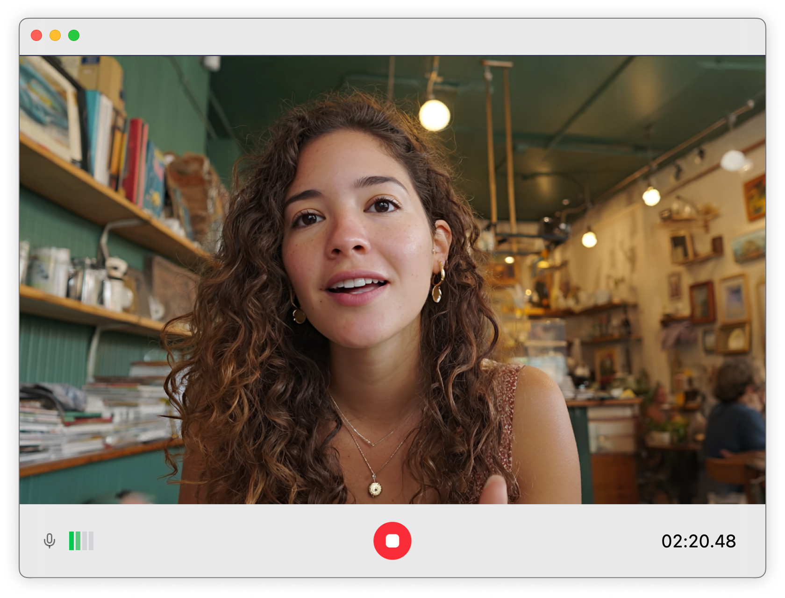

Yap is a desktop app for recording and viewing your video logs. It's the fastest
way to capture your day-to-day and revisit it later.

## Download

Download for macOS, Windows, and Linux from the [releases page](https://github.com/felipap/yap/releases/latest).

## Transcription

Yap transcribes and summarizes your videos if you provide it an OpenAI API key.

## Privacy

Yap stores videos in a folder of your choice inside your computer.

---

## Tasks

- [ ] Feat: skip silent parts.
- [ ] Keep recording if the window closes
- [x] Launch on Hackernews.
- [x] "are you sure you want to close?" dialog.
- [x] Output mp4 straight away instead of having to convert.
- [x] Move transcript to files.
- [x] Fix `ffmpeg not available` error when ffmpeg is, in fact, available.
- [x] An icon that makes sense for "Yap".
- [x] Don't lose the log if the program crashes
